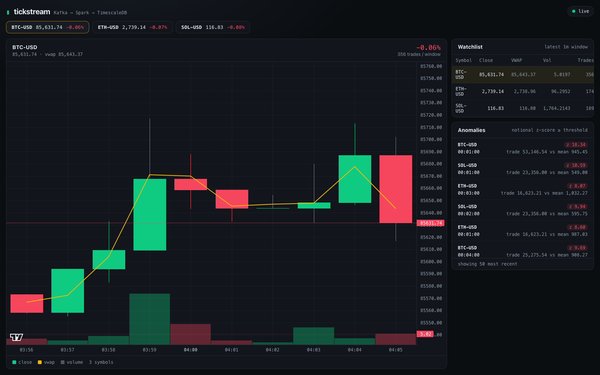
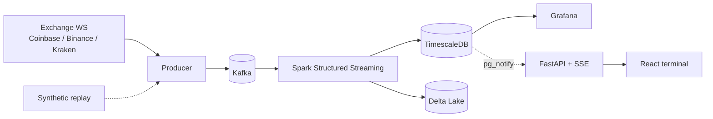
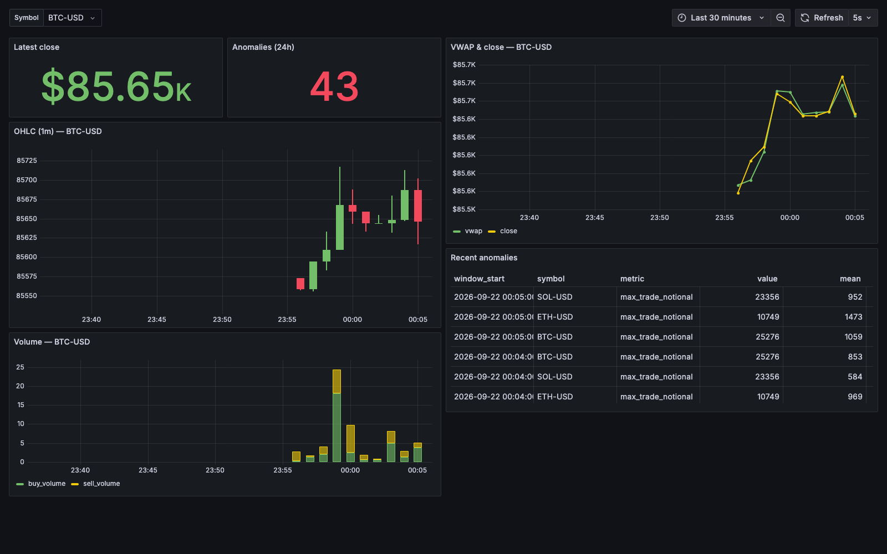

# Real-Time Data Platform

[](https://github.com/PetsEye/tickstream/actions/workflows/ci.yml)
[](https://github.com/PetsEye/tickstream/actions/workflows/benchmark.yml)
[](LICENSE)

Live crypto market analytics on Apache Kafka + Spark Structured
Streaming. Ingests public exchange trades, computes windowed analytics in PySpark,
stores them in TimescaleDB + Delta Lake, and serves a Grafana dashboard and a
React terminal. One `docker compose up`. No API keys, works offline.





## Quickstart

```bash
git clone https://github.com/PetsEye/tickstream.git && cd tickstream
cp .env.example .env
docker compose up -d --build     # Grafana :3000, Spark UI :4040
make web                         # optional: API :8000, React terminal :8080
make smoke                       # verify candles land in TimescaleDB
```

- **Offline:** `TICKSTREAM_PRODUCER__SOURCE=synthetic docker compose up -d`
- **Exchanges:** `coinbase` (default), `binance`, `kraken`, `synthetic`.
  Binance is geo-blocked in some regions, so Coinbase is the default.
- `make down` stops it; `docker compose down -v` also wipes volumes.
- Give Docker ~8–10 GB RAM for the full stack (~2.5 GiB actual).



## Performance

Single-node, measured with `make bench`. Methodology and caveats:
[docs/benchmarks.md](docs/benchmarks.md).

| Metric | Result |
|---|---|
| Producer → Kafka | ~40k msg/s (gzip, idempotent, `acks=all`) |
| End-to-end (Kafka → Spark → Delta) | 1,000 rec/s default · **12,500 rec/s** tuned |
| SSE delivery (database write → browser) | p50 ~11 ms |
| Footprint | ~2.5 GiB (Spark ~1.8 GiB) |

## How it works

- **Producer** (`src/producer`) — pluggable exchange adapters normalize every
  venue into one schema and publish to Kafka **keyed by symbol** (per-symbol
  ordering), with reconnect and a synthetic replay mode.
- **Streaming** (`src/streaming`) — three checkpointed queries: raw trades to the
  Delta bronze zone (+ a dead-letter topic for bad payloads), 1-minute OHLCV/VWAP
  candles, and a sliding-window z-score anomaly detector. Explicit schemas,
  watermarks, dedup, and **idempotent exactly-once sinks** (staging table +
  `ON CONFLICT`; Delta `MERGE`).
- **Serving** (`src/api`, `src/web`) — FastAPI exposes TimescaleDB over REST plus
  an SSE stream driven by Postgres `LISTEN/NOTIFY`; a React/TS terminal consumes
  it. Grafana reads the same tables directly.

### API

`/health` · `/api/symbols` · `/api/summary` · `/api/candles?symbol=BTC-USD` ·
`/api/anomalies` · `/api/stream` (SSE `candle` + `anomaly` events).
Interactive docs at `:8000/docs`.

## Configuration

Precedence: env > `.env` > `config/config.yaml` > defaults. Env vars use the
`TICKSTREAM_` prefix and `__` for nesting, e.g.
`TICKSTREAM_PRODUCER__SOURCE=binance`. Key knobs: symbols, window/slide,
watermark, anomaly threshold, trigger interval, sink settings. Host ports
(Grafana 3000, web 8080, API 8000, Kafka 29092, TimescaleDB 55432) are all
overridable — see `.env.example`.

## Layout

```
src/{common,producer,streaming,api,web}/   code
docker/{producer,spark,api}/               Dockerfiles
sql/init.sql                               hypertables, staging, notify triggers
grafana/provisioning/                      dashboards as code
scripts/                                   smoke test, benchmark, sample data
tests/                                     unit (pure + Spark + API), integration
.github/workflows/                         ci + benchmark
```

## Development

```bash
make install && make lint && make typecheck && make test
make test-spark                  # Spark tests in the container (no local JDK)
cd src/web && npm install && npm run dev
```

Spark and API tests skip automatically when `pyspark` / the `api` extra aren't
installed. Full benchmark methodology: [docs/benchmarks.md](docs/benchmarks.md).

## License

MIT — see [LICENSE](LICENSE).
