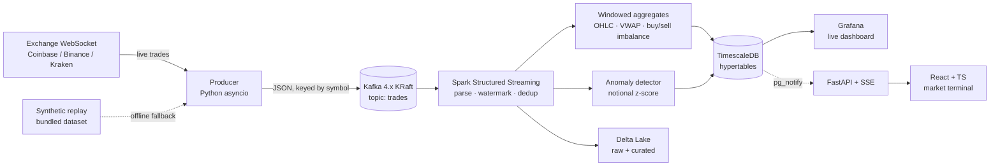

# tickstream

[](https://github.com/PetsEye/tickstream/actions/workflows/ci.yml)
[](https://github.com/PetsEye/tickstream/actions/workflows/benchmark.yml)
[](LICENSE)

**Real-time crypto market analytics on Apache Kafka + Spark Structured Streaming.**

`tickstream` ingests live public crypto trades, processes them with PySpark
Structured Streaming (event-time windows, watermarks, deduplication, anomaly
detection), lands the results in TimescaleDB and a Delta Lake, and serves them
through a live Grafana dashboard and a React market terminal — all with a single
`docker compose up`.

No API keys. No external accounts. Works offline via a bundled synthetic replay.




## Quickstart

```bash
git clone https://github.com/PetsEye/tickstream.git && cd tickstream
cp .env.example .env
docker compose up -d --build
```

Then open **http://localhost:3000** (anonymous viewer is enabled; login
`admin` / `tickstream` to edit) and the **tickstream — Live Market** dashboard.
First candles appear within ~1–2 minutes.

Verify the pipeline end to end:

```bash
make smoke     # waits for candles to land in TimescaleDB, prints a sample
```

Stop everything with `make down` (add `-v` to `docker compose down -v` to also
delete the data volumes).

### Full-stack market terminal

The React/TypeScript terminal and its FastAPI backend are opt-in via a compose
profile so the core pipeline stays lightweight:

```bash
make web     # docker compose --profile web up -d --build
```

Open **http://localhost:8080** for the live terminal (ticker tape, candlestick
chart with VWAP, watchlist, live anomaly feed). It updates over Server-Sent
Events driven by Postgres `LISTEN/NOTIFY` — no polling.


### Run without the internet

```bash
TICKSTREAM_PRODUCER__SOURCE=synthetic docker compose up -d
```

Replays `data/sample_trades.jsonl` (2,000 trades across BTC/ETH/SOL) with
compressed inter-arrival timing. Deterministic, so it is also what CI uses.

### Switch exchanges

```bash
TICKSTREAM_PRODUCER__SOURCE=binance docker compose up -d producer
```

`coinbase` (default), `binance`, `kraken`, and `synthetic` are supported. Binance
is geo-restricted in some regions (notably the US); Coinbase is the default
because it is broadly reachable without an account.

## What it demonstrates

| Area | Where |
|---|---|
| Explicit schema parsing (never `inferSchema`) | `src/streaming/transforms.py` |
| Dead-letter routing for malformed payloads | `make_raw_batch_sink` |
| Event-time tumbling/sliding windows, watermarking | `build_candles`, `build_anomalies` |
| Deterministic OHLC via `min_by`/`max_by` on event time | `build_candles` |
| Stateful deduplication (`dropDuplicates` + watermark) | `deduplicate` |
| Streaming anomaly detection (z-score of trade notional) | `build_anomalies` |
| Exactly-once writes: staging table + `INSERT ... ON CONFLICT` | `src/streaming/sinks.py` |
| Delta Lake bronze/curated zones with `MERGE` upserts | `merge_delta` |
| Checkpointing and graceful restart | `src/streaming/main.py` |
| Pluggable exchange adapters (strategy pattern) | `src/producer/adapters/` |
| Config precedence (YAML < env < CLI) | `src/common/config.py` |
| Async API + SSE push via Postgres `LISTEN/NOTIFY` | `src/api/stream.py` |
| React/TS terminal consuming a live event stream | `src/web/src/hooks/useEventStream.ts` |

## Architecture

**Producer** (`src/producer`) connects to the exchange websocket, normalizes
every venue into one schema (`trade_id, exchange, symbol, price, quantity, side,
trade_ts, ingest_ts`), and publishes JSON to Kafka **keyed by symbol** so all
trades for a symbol share a partition and preserve per-symbol ordering. Trades
are reported with the **taker** side (Coinbase reports the maker side; the
adapter inverts it). Dropped connections self-heal with backoff.

**Streaming job** (`src/streaming`) runs three independent queries, each with its
own checkpoint:

1. `raw_trades` — validated trades to the Delta bronze zone; bad payloads to a
   Kafka dead-letter topic.
2. `candles` — 1-minute OHLCV + VWAP + buy/sell volume per symbol, upserted into
   TimescaleDB and merged into Delta.
3. `anomalies` — sliding-window z-score of the largest trade notional, flagged
   when it exceeds a threshold.

**Serving** — TimescaleDB holds the queryable time series. Grafana reads it
directly, and a FastAPI service exposes it as JSON plus a live SSE stream. Both
serve the same tables Spark writes; there is no second Kafka consumer.

**API + terminal** (`src/api`, `src/web`) — triggers on `candles` and `anomalies`
call `pg_notify`; the API holds one `LISTEN` connection per SSE client and
relays frames to the browser. The React app loads an initial snapshot over REST,
then patches state from the stream. The terminal is served by nginx, which
reverse-proxies `/api` to the API with buffering disabled so SSE flows through.

### API endpoints

| Method | Path | Description |
|---|---|---|
| GET | `/health` | Liveness + database check |
| GET | `/api/symbols` | Distinct traded symbols |
| GET | `/api/summary` | Latest candle per symbol |
| GET | `/api/candles?symbol=BTC-USD&limit=300` | OHLCV + VWAP series |
| GET | `/api/anomalies?limit=100` | Recent anomalies |
| GET | `/api/stream` | SSE: `candle` and `anomaly` events |

Interactive docs are at **http://localhost:8000/docs**.

## Design notes

- **Exactly-once on top of `foreachBatch`.** Spark's `foreachBatch` is
  at-least-once, so sinks are made idempotent. Timescale writes go through a
  staging table and a single transactional
  `INSERT ... ON CONFLICT (…) DO UPDATE`; Delta writes use `MERGE`. Replaying a
  micro-batch after a crash converges to the same state.
- **Watermarks bound state.** A 15s watermark bounds both dedup state and window
  state; `dropDuplicates` on `trade_id` removes exchange retransmits that arrive
  within the watermark.
- **Self-contained anomaly detector.** A global baseline is awkward in
  Structured Streaming, so each window is scored against its own mean/stddev.
  Windows with fewer than `min_trades` trades or zero variance are ignored.
- **Connectors are baked into the image.** The Kafka connector, Delta Lake, and
  the Postgres JDBC driver are downloaded at build time, so job startup needs no
  network and no `--packages` resolution.
- **Python 3.10+.** Matches the interpreter bundled in the official Spark image.

## Performance

Measured on a single Apple Silicon machine (Docker Desktop, 7.65 GiB). Full
methodology, caveats, and reproduction steps in
[docs/benchmarks.md](docs/benchmarks.md); reproduce with `make bench`.

| Metric | Result |
|---|---|
| Producer → Kafka throughput | ~40k msg/s (gzip, idempotent, `acks=all`) |
| Producer publish latency | p50 ~7 ms · p99 ~15 ms |
| End-to-end throughput (Kafka → Spark → Delta) | 1,000 rec/s at defaults · **12,500 rec/s** tuned |
| SSE delivery (database write → browser) | p50 ~11 ms · p95 < 30 ms |
| Footprint | ~2.5 GiB total (Spark ~1.8 GiB) |

The Spark UI is exposed at **http://localhost:4040**.

## Configuration

Precedence: explicit args > environment variables > `.env` > `config/config.yaml`
> defaults. Environment variables use the `TICKSTREAM_` prefix and `__` for
nesting:

```bash
TICKSTREAM_PRODUCER__SOURCE=coinbase
TICKSTREAM_KAFKA__BOOTSTRAP_SERVERS=kafka:29092
TICKSTREAM_ANOMALY__ZSCORE_THRESHOLD=2.5
```

Key knobs live in `config/config.yaml`: symbols, window duration/slide,
watermark, anomaly threshold, checkpoint paths, and sink settings.

Host ports are configurable to avoid collisions (defaults shown):

| Service | Host port | Env var |
|---|---|---|
| Grafana | 3000 | `GRAFANA_HOST_PORT` |
| React terminal | 8080 | `WEB_HOST_PORT` |
| API (FastAPI) | 8000 | `API_HOST_PORT` |
| Kafka (host access) | 29092 | `KAFKA_HOST_PORT` |
| TimescaleDB | 55432 | `TIMESCALE_HOST_PORT` |

## Repository layout

```
tickstream/
├── docker-compose.yml            # kafka, timescale, grafana, producer, spark (+api, web)
├── docker/{producer,spark,api}/  # Dockerfiles
├── config/config.yaml            # typed configuration
├── src/
│   ├── common/                   # config, logging, wire schema
│   ├── producer/                 # adapters/ + kafka sink + entrypoint
│   ├── streaming/                # transforms, sinks, Spark entrypoint
│   ├── api/                      # FastAPI + SSE over TimescaleDB
│   └── web/                      # React + TypeScript + Vite terminal
├── sql/init.sql                  # hypertables, staging tables, notify triggers
├── grafana/provisioning/         # datasource + dashboard as code
├── scripts/                      # topic creation, sample data, smoke test
├── tests/                        # unit (pure + Spark + API) and integration
└── .github/workflows/ci.yml      # ruff, mypy, pytest, web build, docker builds
```

## Development

```bash
make install     # pip install -e ".[dev]"
make lint        # ruff
make typecheck   # mypy
make test        # pytest (Spark tests skip if pyspark is unavailable)
```

API tests need the api extra (`pip install -e ".[api]"`) and skip otherwise. The
frontend lives in `src/web`:

```bash
cd src/web
npm install
npm run dev        # dev server on :5173, proxies /api to :8000
npm run typecheck
npm run build
```

Spark transformation tests need `pyspark`; they are skipped automatically when it
is not installed. The integration test needs a broker:

```bash
TICKSTREAM_INTEGRATION=1 KAFKA_BOOTSTRAP_SERVERS=localhost:29092 pytest tests/integration
```

Useful targets: `make up`, `make web`, `make bench`, `make down`, `make logs`,
`make topics`, `make smoke`, `make producer`.

## Troubleshooting

- **No data on the dashboard.** Confirm the producer is publishing
  (`make logs`) and that `make smoke` passes. Candle windows need at least a
  minute of data plus the watermark delay to finalize.
- **Binance stream unreachable.** It is geo-restricted in some regions. Use
  `coinbase` or `synthetic`.
- **Port already in use.** Set `GRAFANA_HOST_PORT`, `WEB_HOST_PORT`,
  `API_HOST_PORT`, `KAFKA_HOST_PORT`, or `TIMESCALE_HOST_PORT` in `.env`.
- **Terminal shows no candles.** It reads the same tables as Grafana; confirm
  `make smoke` passes. The stream only pushes once windows start updating.
- **Out of memory.** The full stack wants ~5–6 GB. Give Docker Desktop ~8–10 GB
  and adjust `--driver-memory` in the `spark` service if needed.
- **Reset state.** `docker compose down -v` clears Kafka, Timescale, checkpoints,
  and the Delta lake.

## Roadmap

- Prometheus metrics and alerting on top of Spark's streaming metrics.
- Schema registry / Avro instead of JSON.
- Auth on the API and a user-configurable watchlist.
- Multi-broker Kafka and a Spark standalone cluster profile.

## License

MIT — see [LICENSE](LICENSE).
